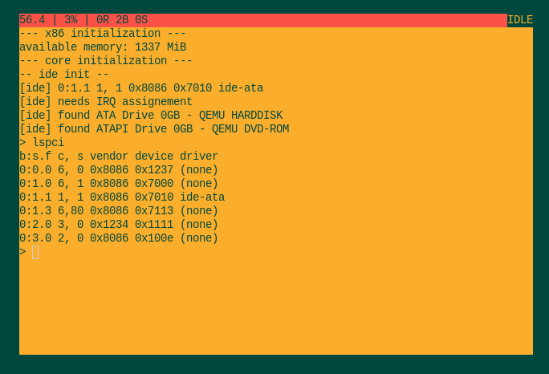

# hobby kernel in zig

# WARNING: this project was written for zig 0.5, it doesn't compile for future versions

### features

 - 80x25 frame buffer
 - ps2 keyboard driver
 - terminal console
 - lspci
 - x86
   - MMU
   - interrupts
   - pit timer
 - scheduler
   - time slice preemption with round robin
   - sleep()
   - block()/unblock()
 - Storage
   - IDE ATA driver (in progress)

### dependencies

  - [ziglang](https://github.com/ziglang/zig) 0.5.0

### compiling

`zig build` compiles and links the multiboot kernel (without a bootloader)

### running

 - `./qemu.sh start`
 - `./qemu.sh monitor`
 - `./qemu.sh quit`
 - `gdb` (see provided `.gdbinit`)

# Notes

## interrupt call chain

`interrupt` -> `idt[n]` -> `isrN` -> `isrDispatch` -> `handlers[n]` (default `unhandled()`)

## References

 - zig microkernel: https://github.com/AndreaOrru/zen
 - scheduling tutorial: https://wiki.osdev.org/Brendan%27s_Multi-tasking_Tutorial
 - booting/paging/interrupts: https://os.phil-opp.com/
